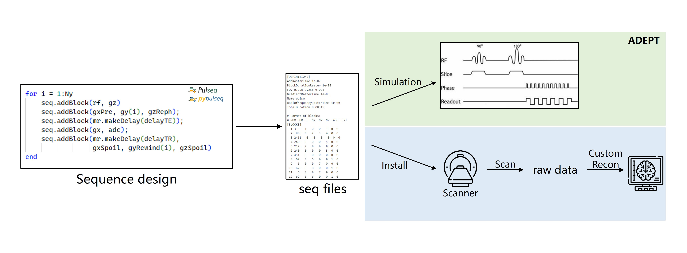
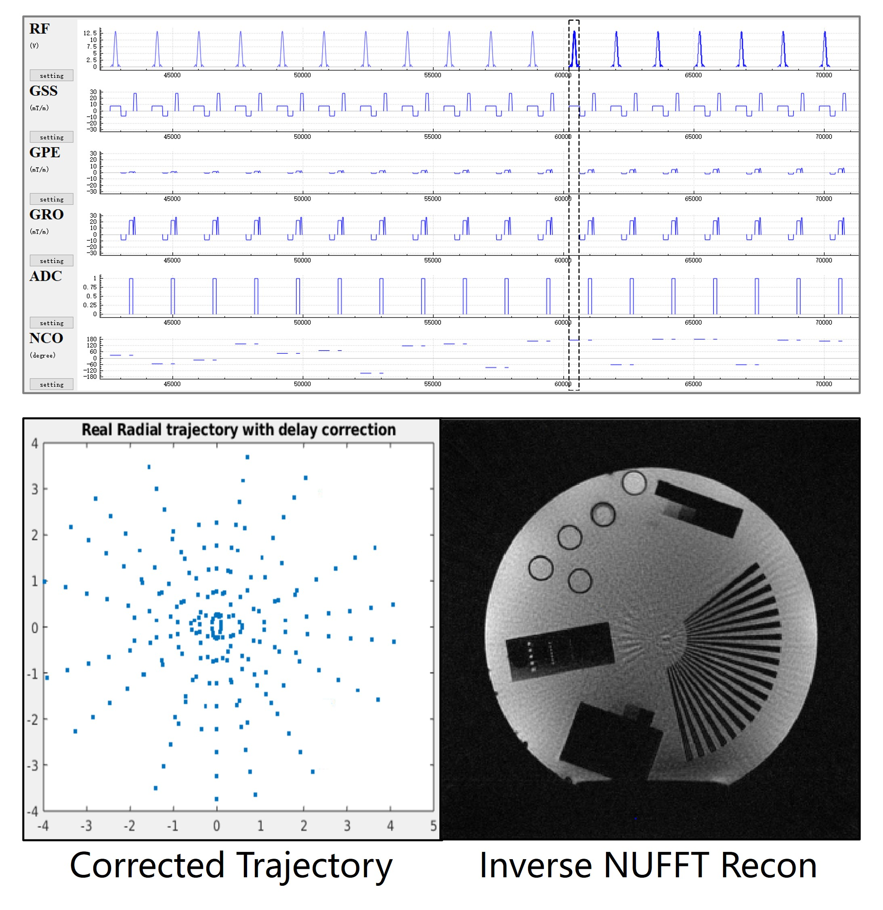
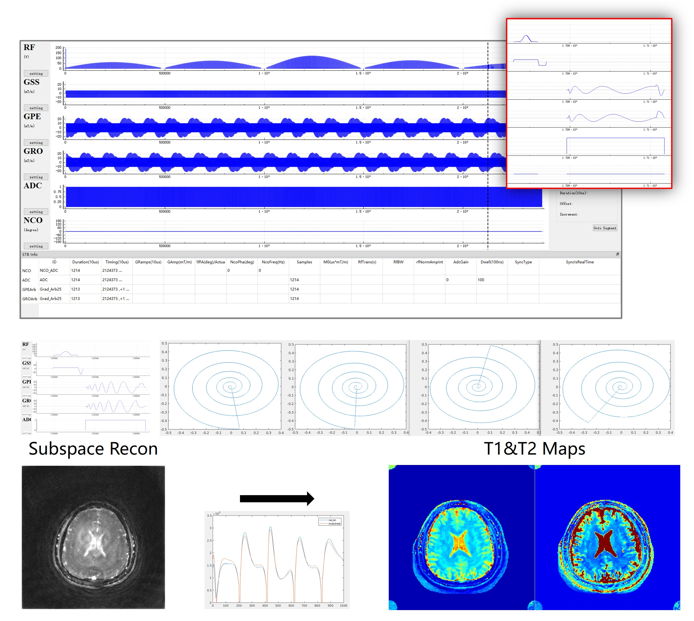

**uMR Application Development Environment and Programming Tools** (ADEPT) platform now fully supports the Pulseq open-source framework with our Pulseq Interpreter. From standard 3T research systems, to our pioneering 5T platform, to cutting-edge 9.4T ultra-high field systems, uMR ADEPT offers full compatibility, paving the way for your research innovations.

# Features

- **Full Field Strength and System Support**: Covering 3T research systems, United Imaging's pioneering 5T platform, and 9.4T ultra-high field research equipment, enabling single development for multi-platform research applications.  

- **Complete Compatibility**: Fully compatible with the Pulseq open-source framework, ensuring your research sequences can run on United Imaging equipment with minimal modifications, truly realizing "write once, run anywhere".  

- **Powerful Development Tools**: Providing professional tools for sequence waveform simulation, raw data acquisition, and more, helping researchers seamlessly integrate the entire workflow of development, testing, and analysis.  

- **Comprehensive Documentation**: Pulseq user manuals optimized for United Imaging MR system characteristics, including detailed examples and best practices, accelerating your research sequence development process.  

- **Global Research Collaboration**: Professional global research collaboration team providing prompt response to researchers.
  
- **Open Ecosystem**: Join the global MR research community to jointly promote MRI technology innovation.  

# Showcases

### Case1: Radial 2D
source code: https://github.com/pulseq/pulseq/blob/v1.4.2/matlab/demoSeq/writeRadialGradientEcho.m 

       

### Case2: MRF   
source code: https://github.com/imr-framework/mrf    

    

    

### Case3: Music   
Music written in Pulseq and running on the uMR NX platform.  

    <iframe src="//player.bilibili.com/player.html?isOutside=true&aid=114136977579944&bvid=BV1vqRGYBExf&cid=28792720518&p=1" scrolling="no" border="0" frameborder="no" framespacing="0" allowfullscreen="true" width="400x" style="text-align:left !important; margin: 0 !important; padding: 0 !important;"></iframe>

 

# Latest Updates

**Jan 2025**: First edition released with full support of Pulseq v1.4  

# Getting Started

To obtain the United Imaging Pulseq Interpreter, you need to sign a magnetic resonance research collaboration agreement with United Imaging MR.

# Contact Us
Email: MR_ADEPT@united-imaging.com    

*United Imaging is committed to promoting innovation and openness in MR technology, looking forward to exploring the future of medical imaging with researchers worldwide.*